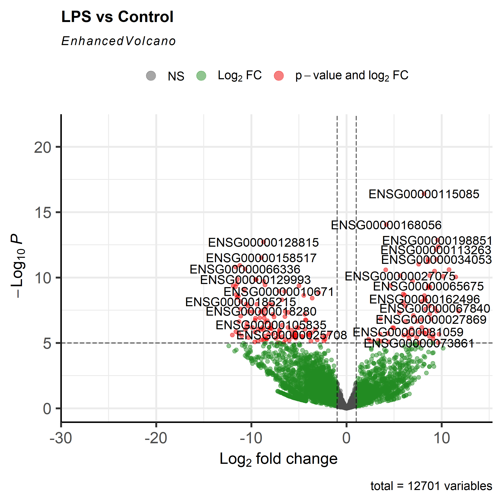
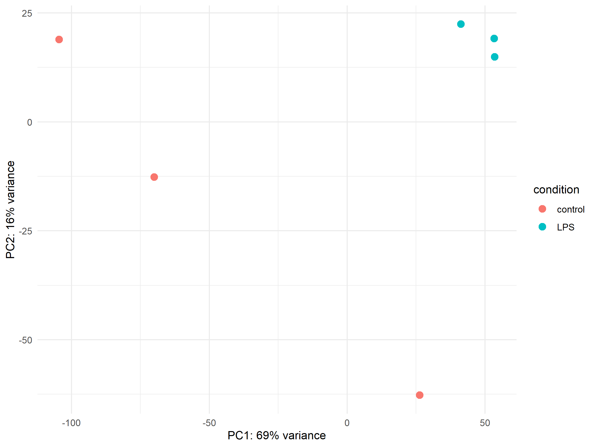
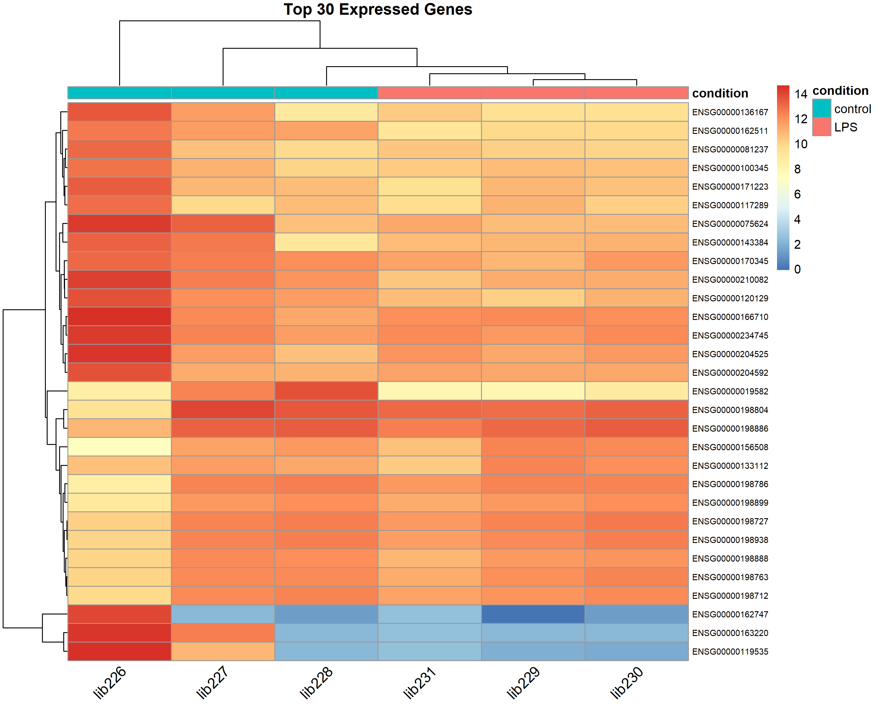

# 🧬 RNA-Seq Differential Expression Analysis (GSE60424)

This project performs **differential gene expression analysis** using [DESeq2](https://bioconductor.org/packages/release/bioc/html/DESeq2.html) in R on the publicly available **RNA-Seq dataset GSE60424**. The goal is to identify genes that are significantly upregulated or downregulated in **LPS-stimulated immune cells** compared to **control** conditions.

---

## 📂 Dataset Overview

**GSE60424** (from NCBI GEO):  
> RNA-Seq profiling of human immune cell subsets across various immune-associated diseases and conditions.

- **Organism**: *Homo sapiens*
- **Samples used**: Subset from GSE60424 (LPS vs Control)
- **Experiment type**: Expression profiling by high-throughput sequencing
- **Platform**: Illumina HiScanSQ

📎 [NCBI GEO Series Link](https://www.ncbi.nlm.nih.gov/geo/query/acc.cgi?acc=GSE60424)

---

## 🛠 Tools & Packages

- **Language**: R
- **Key Packages**:
  - `DESeq2` – for differential expression
  - `pheatmap` – for heatmap generation
  - `EnhancedVolcano` – for volcano plots
  - `ggplot2` – for PCA visualization

---

## 📊 Results & Biological Interpretations

All plots and DE result files are stored in the `results/` folder.

---

### 🔬 Volcano Plot



> **Interpretation**:  
This volcano plot visualizes differential gene expression based on:
- **X-axis**: Log2 Fold Change (magnitude of change)
- **Y-axis**: –log10(P-value) (statistical significance)  
Each point represents a gene:
- **Top right**: significantly **upregulated** genes in LPS-stimulated samples  
- **Top left**: significantly **downregulated** genes  
- The further away a gene is from the center, the stronger and more significant the regulation.

Use this plot to **identify key immune response genes or biomarkers** triggered by LPS stimulation.

---

### 🧬 PCA Plot



> **Interpretation**:  
Principal Component Analysis (PCA) summarizes the gene expression variation:
- Each point represents a **sample**
- **Color** represents the sample group (LPS vs Control)
- **PC1 and PC2** represent the major axes of expression variance

The plot shows clear **group separation**, indicating that LPS stimulation leads to a **global shift in gene expression**, highlighting its **strong biological effect**.

---

### 🧪 Heatmap of Top 30 DEGs



> **Interpretation**:  
This heatmap displays the expression of the **top 30 most variable genes** across all samples:
- **Rows**: Genes (ENSEMBL IDs)
- **Columns**: Samples
- **Colors**: Red = high expression, Blue = low expression

Clustering shows that **samples within the same group cluster together**, and certain genes exhibit **consistent expression patterns** across conditions. This supports the reliability of the DE results and hints at possible **gene modules** activated or suppressed by LPS stimulation.

---

## 🧪 How to Reproduce This Analysis

1. Clone the repository:

```bash
git clone https://github.com/5aifali6/rna-seq-DE-analysis.git
cd rna-seq-DE-analysis
